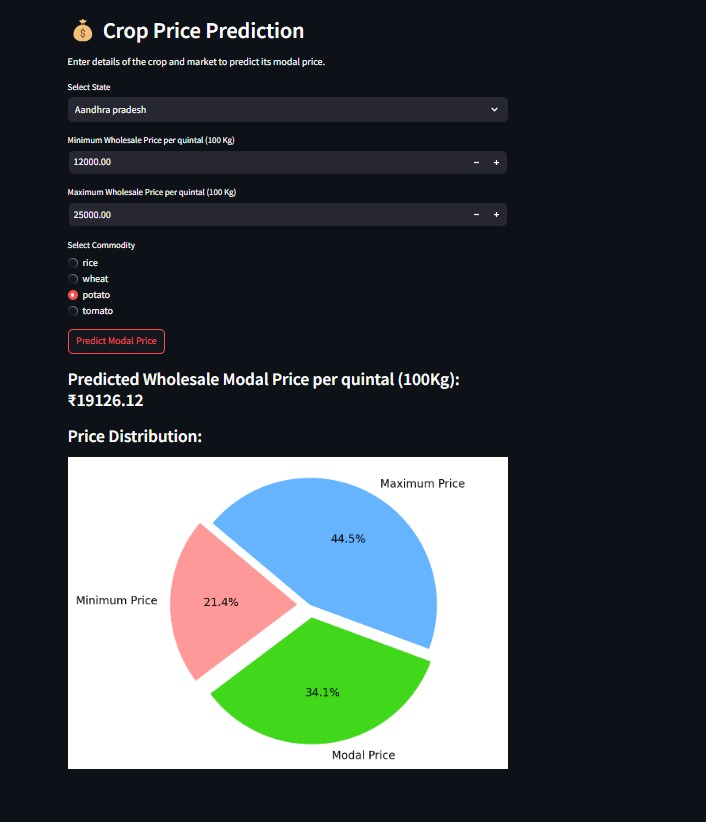
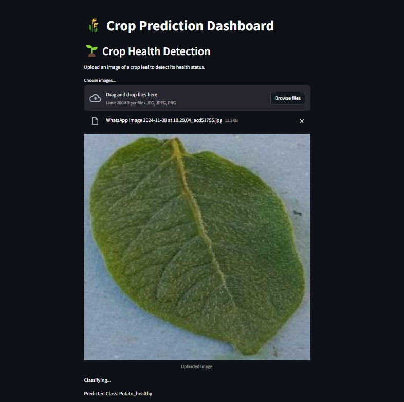

# 🌾 Agriculture Crop Price and Health Detection

This project provides a streamlined tool to predict crop prices and diagnose crop health. Using machine learning models, it empowers farmers and agricultural stakeholders by offering insights into crop price trends and identifying potential diseases in crop leaves.

## Project Overview

This application has two core functionalities:

1. **Crop Price Prediction**:
   - Users can predict the wholesale modal price per quintal (100 kg) for selected crops by specifying:
     - **State**
     - **Minimum and Maximum Wholesale Prices per Quintal**
     - **Crop Type** (rice, wheat, potato, or tomato)
   - The output includes:
     - The **Predicted Modal Price**.
     - A **Price Distribution** chart showing minimum, modal, and maximum prices for better market analysis.

2. **Crop Health Detection**:
   - Users can upload an image of a crop leaf to classify it as **healthy** or **unhealthy**.
   - The tool supports image formats like JPG, JPEG, and PNG, and processes the image to identify disease presence.

## Application Workflow

1. **Crop Price Prediction**:
   - **Input**: State, minimum and maximum wholesale prices, and crop type.
   - **Output**: Predicted modal price and a pie chart visualizing the price distribution.

2. **Crop Health Detection**:
   - **Input**: An image of the crop leaf.
   - **Output**: Classification result (e.g., `Potato_healthy`) along with the uploaded image for verification.

## Technology Stack

- **Frontend**: Streamlit for the interactive user interface.
- **Backend**: Machine learning models for price prediction and image classification.
- **Data**: Crop price data and leaf images for health status detection.

## How to Run the Project

1. Clone this repository.
2. Install the required dependencies:
   ```bash
   pip install -r requirements.txt
3. Run the application with Streamlit:
  ```bash
     streamlit run app.py

## Screenshots

### Crop Health Detection


### Crop Price Prediction



